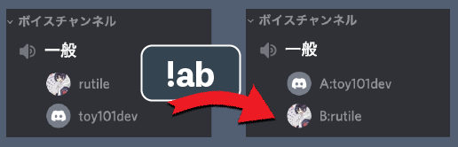

# AB-chan
チーム分けBot

## 説明
- 同じボイスチャンネルの参加者を2チーム（Aチーム, Bチーム）に分けます
- 表示名（ニックネーム）の先頭にチームタグをつけることで, チームごとに整列しわかりやすく表示させます.
- 元に戻すコマンドもあるので終了時も楽です！

大人数でゲームをするときや, ディスコ上でのオンライン呑み会の余興などで使っていただけたら幸いです！



### インストール
- [このURL](https://discord.com/api/oauth2/authorize?client_id=926784823933157406&permissions=201326592&scope=bot)からご自身がサーバー主のディスコ鯖に参加させられます.

### 使い方
- `!ab`
```
コマンド送信主が参加しているボイスチャンネルのメンバーの表示名先頭にチームタグをつけます
```
- `!reset`
```
ついているチームタグを外し表示名を元に戻します
```

### ご注意
- `サーバー主`は権限の問題で`表示を変更できません`...
    - かわりにチャットでどちらのチームに属するか表示します.
- `Heroku`上にデプロイしているのでしばらく使われていないとレスポンスが遅いときがあります...ご了承ください...